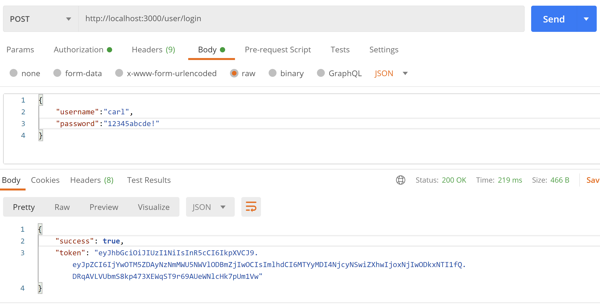
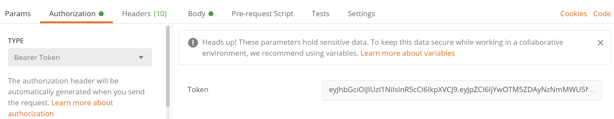
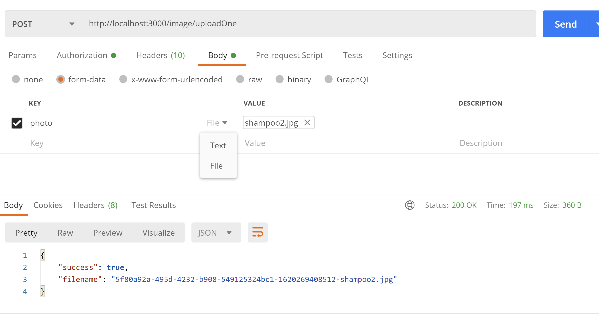
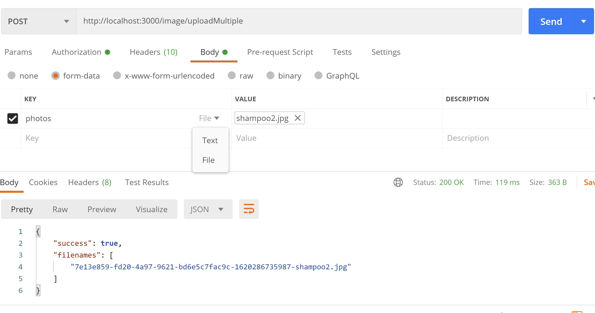
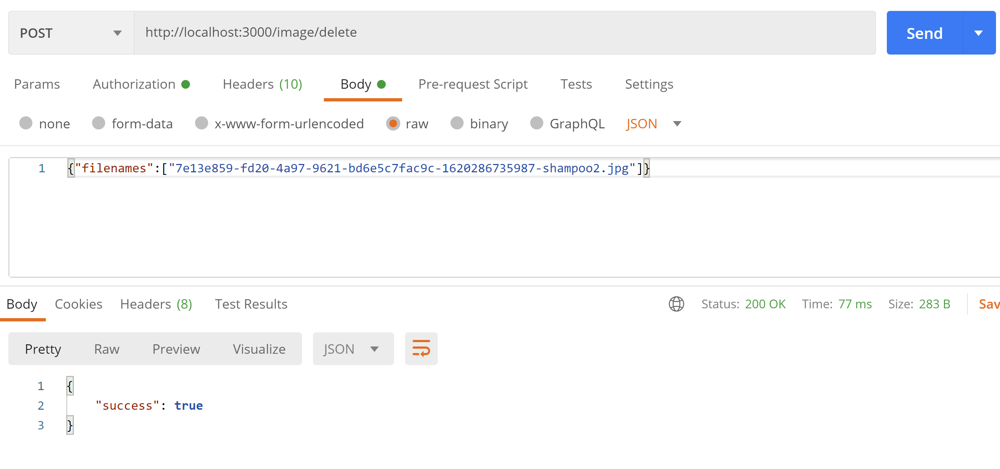
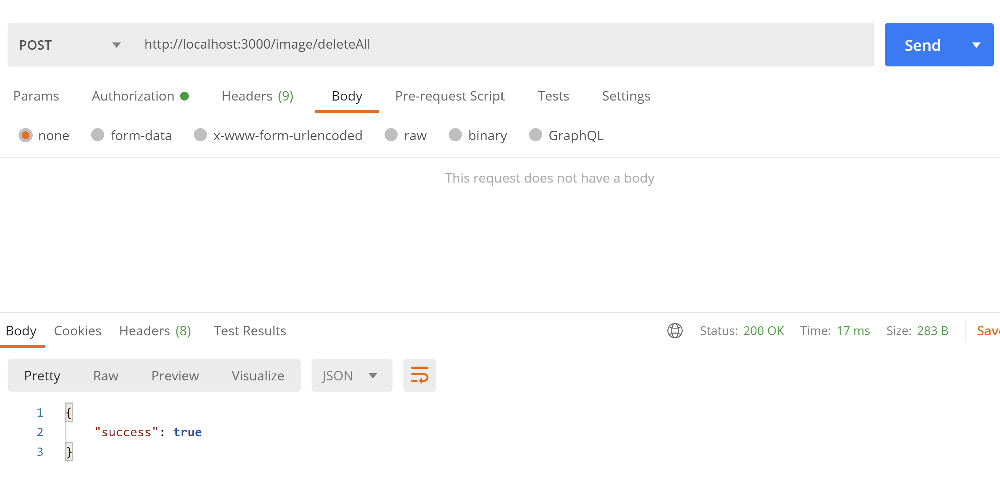
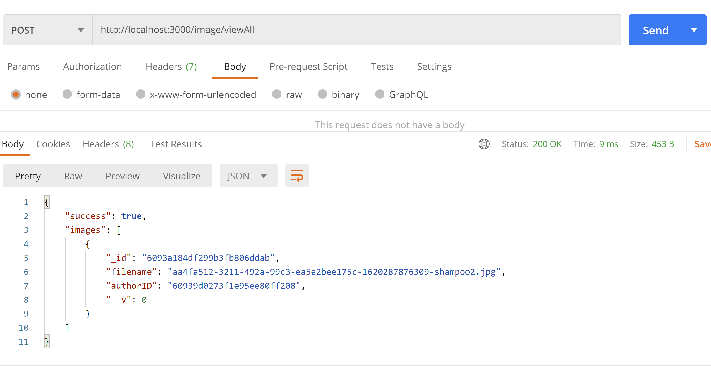

# Shopify Backend Intern Challenge: Image Repo
## Setup
Note that these instructions are for a Windows machine. If trying to run on a different OS, some setup instructions may differ (although the changes should be straightforward and obvious enough)

In order to run this application, you will need to have Node.js, npm, and mongo installed on your system.

1. Start a local instance of MongoDB at localhost:27017. In a terminal/shell, run:

```mongod```

Depending on your configuration for mongodb, you may have to run something like this instead:

```mongod --dbpath="C:\Program Files\MongoDB\Server\4.2\data"```

Keep this terminal/shell open

2. Open a seperate terminal/shell and clone the repository

```git clone https://github.com/JankyCS/shopify-backend-intern-challenge-fall2021.git```

3. Switch to the server directory:

```cd shopify-backend-intern-challenge-fall2021\server```

4. Install the dependencies:

```npm install```

## Run Jest.js Tests
First, complete all the instructions for setup.
1. In the server directory, run:
```npm run tests```

## Instructions for Use/Manual Testing
First, complete all the instructions for setup. Make sure the mongodb is still up and running 

I recommend using Postman to use this application, as it will make image uploads easier, but feel free to use any tool to make thee API requests.

1. Start the server

In the server directory, run:
```node start.js```

2. Register a User

Make a POST request to ```http://localhost:3000/user/register``` with the username and password of the new user


The response will contain the encrypted password.

3. Login as a User

Make a POST request to ```http://localhost:3000/user/login``` with the username and password of the registered user


The response will contain a JSON Web Token. Keep this token, as the JWT will be used to authenticate for all of the upload/delete endpoints

4. Authentication

All upload/delete endpoints will require the token to be sent in the header as Authorization, to authorize the user


5. Upload

To upload a single image, make a POST request to ```http://localhost:3000/image/uploadOne```. The image to be uploaded is sent as the ```photo``` parameter in the request body.
Make sure the content-type is ```multipart/form-data```



To upload a multiple image, make a POST request to ```http://localhost:3000/image/uploadMultiple```. The images to be uploaded are sent as the ```photos``` parameter in the request body.
Make sure the content-type is ```multipart/form-data```



The response from these endpoints will be the filename(s) of the uploaded images

6. Delete

To delete images, make a POST request to ```http://localhost:3000/image/delete``` with an array ```filenames``` of the names of every image file to be deleted. Only the user who uploaded the image can delete it.


To delete all images uploaded by the user, make a POST request to ```http://localhost:3000/image/deleteAll```.


7. View All Images

To view all of the images in the repo, make a POST request to ```http://localhost:3000/image/viewAll```. No authentication token is required for this endpoint.


The response will be an array of the data for each image, including its file name and the id of the author.

8. View a Particular Image

To view any particular uploaded image, make a GET request to ```http://localhost:3000/${FILE_NAME}```. No authentication token is required for this endpoint. The file name can be retrieved from the viewAll endpoint, or can be saved from when the image was originally uploaded.


